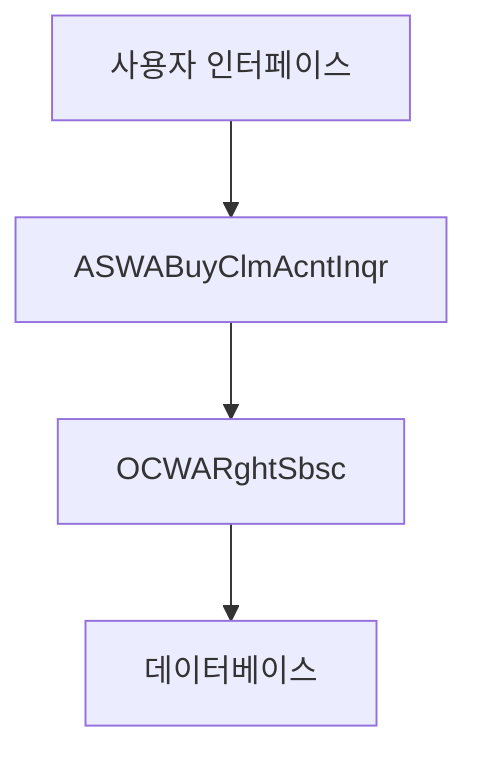
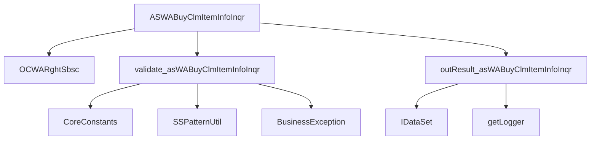
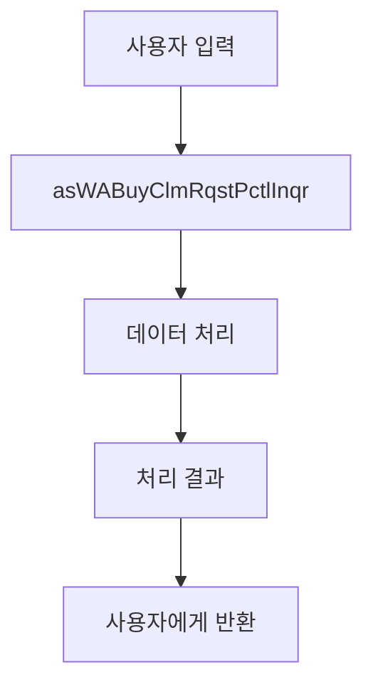
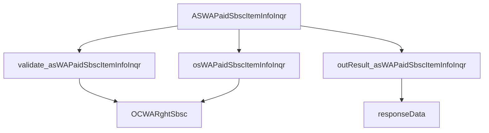
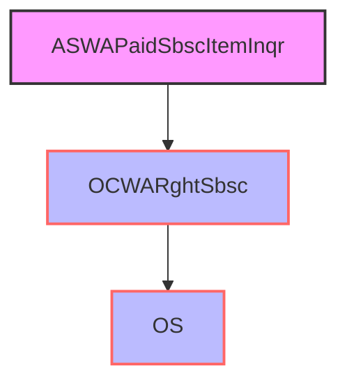
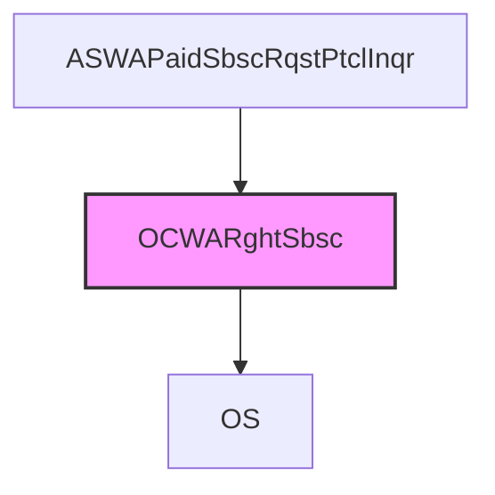

# 프로그램 명세서 - acwarghtsbsc (폴더)

## 폴더 구조

```
└── acwarghtsbsc
    ├── .DS_Store
    ├── .scmignore
    ├── biz
    │   ├── ASWABuyClmAcntInqr.bizunit
    │   ├── ASWABuyClmAcntInqr.java
    │   ├── ASWABuyClmItemInfoInqr.bizunit
    │   ├── ASWABuyClmItemInfoInqr.java
    │   ├── ASWABuyClmRqstPctlInqr.bizunit
    │   ├── ASWABuyClmRqstPctlInqr.java
    │   ├── ASWAPaidSbscAcntInqr.bizunit
    │   ├── ASWAPaidSbscAcntInqr.java
    │   ├── ASWAPaidSbscItemInfoInqr.bizunit
    │   ├── ASWAPaidSbscItemInfoInqr.java
    │   ├── ASWAPaidSbscItemInqr.bizunit
    │   ├── ASWAPaidSbscItemInqr.java
    │   ├── ASWAPaidSbscRqstPtclInqr.bizunit
    │   └── ASWAPaidSbscRqstPtclInqr.java
    ├── ejb
    │   └── .scmignore
    └── wa.ac.ACWARghtSbsc.component
```


## 자바 파일 목록

- ASWABuyClmAcntInqr.java
- ASWABuyClmItemInfoInqr.java
- ASWABuyClmRqstPctlInqr.java
- ASWAPaidSbscAcntInqr.java
- ASWAPaidSbscItemInfoInqr.java
- ASWAPaidSbscItemInqr.java
- ASWAPaidSbscRqstPtclInqr.java

## ASWABuyClmAcntInqr.java

### 1. 개요

asWABuyClmAcntInqr

- 이 메소드는 사용자의 입력 데이터를 기반으로 계좌 정보를 조회하고, 그 결과를 반환합니다.
- 입력 데이터에는 구매 클레임 구분 코드, 랩 상품 번호, 아이템 코드, 기초 일자, 컨텍스트 영역 번호, 컨텍스트 영역 키 등이 포함됩니다.
- 출력 데이터는 계좌 번호, 랩 계약 번호, 사용 가능 계좌 번호, 사용 가능 계좌 상품 코드, 계좌 이름, 보유량, 요청량, 가능량, 구매 클레임 요청량, 구매 클레임 가능량, 보고 상품 번호 등이 포함됩니다.

<details>
<summary><strong>관련 클래스</strong></summary>

- kis.wa.oc.ocwarghtsbsc.ejb.OCWARghtSbsc

</details>

<details>
<summary><strong>클래스 사용 방법</strong></summary>

이 메소드는 `requestData`와 `onlineCtx`를 입력으로 받아 계좌 정보를 조회하고, `responseData`를 반환합니다. 사용 시, 필요한 데이터를 `requestData`에 설정하고, `asWABuyClmAcntInqr` 메소드를 호출하여 결과를 받습니다.

</details>

<details>
<summary><strong>시스템 아키텍처</strong></summary>

전체 시스템은 다음과 같은 구성 요소로 이루어져 있습니다:
1. 사용자 인터페이스: 사용자가 데이터를 입력할 수 있는 화면
2. 비즈니스 로직: `ASWABuyClmAcntInqr` 클래스와 `OCWARghtSbsc` 클래스
3. 데이터 액세스 객체: 데이터베이스와 통신하여 데이터를 조회하고 저장

</details>

<details>
<summary><strong>프로젝트 다이어그램</strong></summary>



</details>

<details>
<summary><strong>코드 설명</strong></summary>

- `asWABuyClmAcntInqr` 메소드는 사용자의 입력 데이터를 검증하고, OS 시스템에 데이터를 전송하여 결과를 반환합니다.
- `validate_asWABuyClmAcntInqr` 메소드는 입력 데이터를 검증하여 컨텍스트 영역 번호를 설정합니다.
- `outResult_asWABuyClmAcntInqr` 메소드는 조회 결과를 반환하고, 결과에 따라 메시지를 설정합니다.

</details>

## ASWABuyClmItemInfoInqr.java

### 1. 개요

asWABuyClmItemInfoInqr

- 구매 클레임 항목을 조회하는 메소드입니다. 입력된 데이터를 기반으로 필요한 정보를 조회하고, 그 결과를 반환합니다.

<details>
<summary><strong>관련 클래스</strong></summary>

- kis.wa.oc.ocwarghtsbsc.ejb.OCWARghtSbsc

</details>

<details>
<summary><strong>클래스 사용 방법</strong></summary>

1. 입력 데이터를 IDataSet 형태로 준비합니다.
2. `asWABuyClmItemInfoInqr` 메소드를 호출하면서 입력 데이터와 컨텍스트를 함께 전달합니다.
3. 메소드가 반환한 IDataSet에는 조회된 결과가 포함되어 있습니다.

</details>

<details>
<summary><strong>시스템 아키텍처</strong></summary>

이 시스템은 주로 비즈니스 로직과 데이터 처리를 담당하는 서비스 계층을 포함합니다. 주요 구성 요소로는 비즈니스 로직을 담당하는 `ASWABuyClmItemInfoInqr` 클래스와, 실제 데이터베이스와의 상호작용을 담당하는 `OCWARghtSbsc` 클래스가 있습니다.

</details>

<details>
<summary><strong>프로젝트 다이어그램</strong></summary>



</details>

<details>
<summary><strong>코드 설명</strong></summary>

1. **메소드 `asWABuyClmItemInfoInqr`**:
    - 입력 데이터를 검증하고, OS 시스템에 데이터를 전송하여 조회 결과를 반환합니다.
    - 필요한 필드를 설정하고, OS 시스템과 통신하여 데이터를 조회합니다.
    - 조회 결과를 클라이언트에 반환합니다.

2. **메소드 `validate_asWABuyClmItemInfoInqr`**:
    - 입력 데이터의 유효성을 검사합니다.
    - 필요한 필드를 설정하고, 컨텍스트 영역의 정보를 확인하여 올바른 값을 설정합니다.

3. **메소드 `outResult_asWABuyClmItemInfoInqr`**:
    - 조회 결과를 처리하고, 클라이언트에 반환할 데이터를 설정합니다.
    - 결과에 따라 적절한 메시지를 설정하여 반환합니다.

이 프로그램은 구매 클레임 항목을 조회하는 기본적인 기능을 제공하며, 필요에 따라 추가적인 기능을 구현할 수 있습니다.

</details>

## ASWABuyClmRqstPctlInqr.java

### 1. 개요

asWABuyClmRqstPctlInqr

- 이 메소드는 사용자가 입력한 데이터를 기반으로 구매 사고 처리 내역을 조회하는 데 사용됩니다. 입력된 데이터는 구매 사고의 상세 내역을 조회하는 데 필요한 정보를 포함합니다.

<details>
<summary><strong>관련 클래스</strong></summary>

- kis.framework.base.ApplService
- kis.wa.oc.ocwarghtsbsc.ejb.OCWARghtSbsc

</details>

<details>
<summary><strong>클래스 사용 방법</strong></summary>

이 메소드는 `requestData`와 `onlineCtx`라는 두 개의 매개변수를 받습니다. `requestData`는 사용자가 입력한 데이터를 포함하고 있으며, `onlineCtx`는 사용자의 컨텍스트 정보를 포함합니다. 이 메소드는 입력된 데이터를 기반으로 처리한 후, 처리 결과를 `responseData`라는 데이터 셋으로 반환합니다.

</details>

<details>
<summary><strong>시스템 아키텍처</strong></summary>

이 프로그램은 사용자의 입력 데이터를 받아 처리하고, 그 결과를 반환하는 역할을 합니다. 주요 구성 요소로는 사용자 입력 데이터를 받는 부분, 데이터를 처리하는 부분, 그리고 처리 결과를 반환하는 부분이 있습니다.

</details>

<details>
<summary><strong>프로젝트 다이어그램</strong></summary>



</details>

<details>
<summary><strong>코드 설명</strong></summary>


</details>

<details>
<summary><strong># 데이터 유효성 검사</strong></summary>

- `validate_asWABuyClmRqstPctlInqr` 메소드는 사용자가 입력한 데이터의 유효성을 검사합니다. 이 때, 필요한 데이터가 누락되었는지, 형식이 올바른지 등을 확인합니다.
- 데이터의 유효성 검사를 통과하지 못하면, 올바르지 않은 데이터에 대한 예외 처리를 수행합니다.

</details>

<details>
<summary><strong># OS 호출</strong></summary>

- `OCWARghtSbsc` 객체를 통해 OS 서비스를 호출합니다. 이 때, 사용자의 입력 데이터를 OS 서비스에 전달하여 처리를 요청합니다.
- OS 서비스의 응답 데이터를 받아 사용자에게 반환합니다.

</details>

<details>
<summary><strong># 처리 결과 반환</strong></summary>

- `outResult_asWABuyClmRqst

</details>

## ASWAPaidSbscAcntInqr.java

### 1. 개요

## ASWAPaidSbscItemInfoInqr.java

### 1. 개요

asWAPaidSbscItemInfoInqr

- 이 메소드는 결제 가입 정보를 조회하는 데 사용됩니다. 입력 데이터와 컨텍스트 정보를 받아 결과 데이터를 반환합니다.

<details>
<summary><strong>관련 클래스</strong></summary>

- kis.wa.oc.ocwarghtsbsc.ejb.OCWARghtSbsc

</details>

<details>
<summary><strong>클래스 사용 방법</strong></summary>

이 메소드는 다음과 같은 방식으로 사용됩니다:
1. 입력 데이터를 `requestData` 매개변수로 전달합니다.
2. 컨텍스트 정보를 `onlineCtx` 매개변수로 전달합니다.
3. 메소드는 결과 데이터를 `responseData`로 반환합니다.

</details>

<details>
<summary><strong>시스템 아키텍처</strong></summary>

이 클래스는 다음과 같은 주요 구성 요소를 포함합니다:
1. 입력 데이터 검증: `validate_asWAPaidSbscItemInfoInqr` 메소드를 통해 입력 데이터의 유효성을 검사합니다.
2. OS 서비스 호출: `OCWARghtSbsc` 비즈니스 컴포넌트를 통해 OS 서비스를 호출하여 결제 가입 정보를 조회합니다.
3. 결과 처리: `outResult_asWAPaidSbscItemInfoInqr` 메소드를 통해 조회된 결과를 처리하고 응답 데이터로 반환합니다.

</details>

<details>
<summary><strong>프로젝트 다이어그램</strong></summary>



</details>

<details>
<summary><strong>코드 설명</strong></summary>

- `validate_asWAPaidSbscItemInfoInqr` 메소드는 입력 데이터의 유효성을 검사합니다. 특히, `CTX_AREA_NK` 필드의 값을 검증하고, 필요에 따라 `CTX_AREA_FK` 필드를 설정합니다.
- `osWAPaidSbscItemInfoInqr` 메소드는 OS 서비스를 호출하여 결제 가입 정보를 조회합니다.
- `outResult_asWAPaidSbscItemInfoInqr` 메소드는 조회된 결과를 처리하고, 응답 데이터를 설정합니다. 결과에 따라 적절한 메시지를 반환합니다.

</details>

## ASWAPaidSbscItemInqr.java

### 1. 개요

asWAPaidSbscItemInqr

- 이 메소드는 사용자가 입력한 조건에 따라 가입된 항목을 조회하는 기능을 제공합니다.
- 입력 데이터는 `requestData`로, 출력 데이터는 `responseData`로 반환됩니다.

<details>
<summary><strong>관련 클래스</strong></summary>

- kis.framework.base.ApplService
- kis.wa.oc.ocwarghtsbsc.ejb.OCWARghtSbsc

</details>

<details>
<summary><strong>클래스 사용 방법</strong></summary>

1. `requestData`에 사용자가 입력한 조건을 설정합니다.
2. `asWAPaidSbscItemInqr` 메소드를 호출하여 조회를 요청합니다.
3. `responseData`에 조회 결과가 반환됩니다.

</details>

<details>
<summary><strong>시스템 아키텍처</strong></summary>

전체 시스템은 다음과 같은 구성 요소로 이루어져 있습니다:
- **ASWAPaidSbscItemInqr**: 사용자 요청을 처리하고 OS와의 통신을 통해 데이터를 조회합니다.
- **OCWARghtSbsc**: OS와의 통신을 담당하는 비즈니스 컴포넌트입니다.

</details>

<details>
<summary><strong>프로젝트 다이어그램</strong></summary>



</details>

<details>
<summary><strong>코드 설명</strong></summary>

- **validate_asWAPaidSbscItemInqr**: 입력 데이터의 유효성을 검사합니다. 필요한 경우 오류를 발생시키거나 추가적인 처리를 수행합니다.
- **outResult_asWAPaidSbscItemInqr**: 조회 결과를 사용자에게 반환합니다. 결과에 따라 다른 메시지를 출력합니다.
- **asWAPaidSbscItemInqr**: 사용자 요청을 처리하고 조회 결과를 반환합니다. OS와의 통신을 통해 데이터를 조회하고, 그 결과를 사용자에게 반환합니다.

</details>

## ASWAPaidSbscRqstPtclInqr.java

### 1. 개요

asWAPaidSbscRqstPtclInqr

- 이 메소드는 지불 구독 요청 프로토콜을 조회하는 데 사용됩니다. 입력된 데이터를 검증하고, OS(원주공동주택 서비스)와 통신하여 데이터를 조회한 후, 결과를 반환합니다.

<details>
<summary><strong>관련 클래스</strong></summary>

- kis.wa.oc.ocwarghtsbsc.ejb.OCWARghtSbsc

</details>

<details>
<summary><strong>클래스 사용 방법</strong></summary>

이 클래스는 원주공동주택 서비스와 통신하여 지불 구독 정보를 조회하는 데 사용됩니다. 입력된 요청 데이터를 검증하고, OS와 통신하여 데이터를 조회한 후, 결과를 반환합니다.

</details>

<details>
<summary><strong>시스템 아키텍처</strong></summary>

전체 시스템은 원주공동주택 서비스와 통신하는 구조로 되어 있습니다. 주요 구성 요소로는 이 클래스, OCWARghtSbsc 클래스, 그리고 기타 공통 데이터 처리 클래스가 있습니다.

</details>

<details>
<summary><strong>프로젝트 다이어그램</strong></summary>



</details>

<details>
<summary><strong>코드 설명</strong></summary>

- **validate_asWAPaidSbscRqstPtclInqr**: 입력된 데이터를 검증하는 메소드입니다. 특정 조건에 따라 데이터를 조정하거나 예외를 발생시킬 수 있습니다.
- **outResult_asWAPaidSbscRqstPtclInqr**: 조회 결과를 처리하고 응답 데이터를 설정하는 메소드입니다. 조회 결과에 따라 적절한 메시지를 설정하여 응답합니다.
- **asWAPaidSbscRqstPtclInqr**: 실제로 지불 구독 요청 프로토콜을 조회하는 메소드입니다. 입력된 데이터를 검증하고, OS와 통신하여 데이터를 조회한 후, 결과를 반환합니다.

</details>

